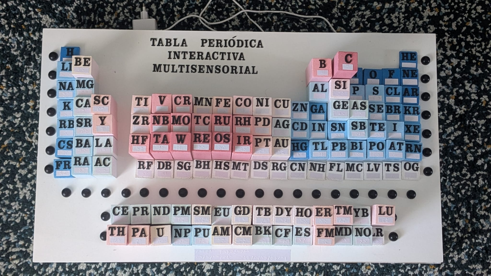
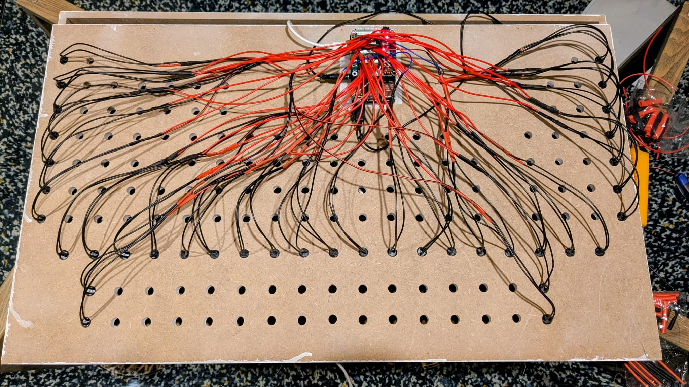
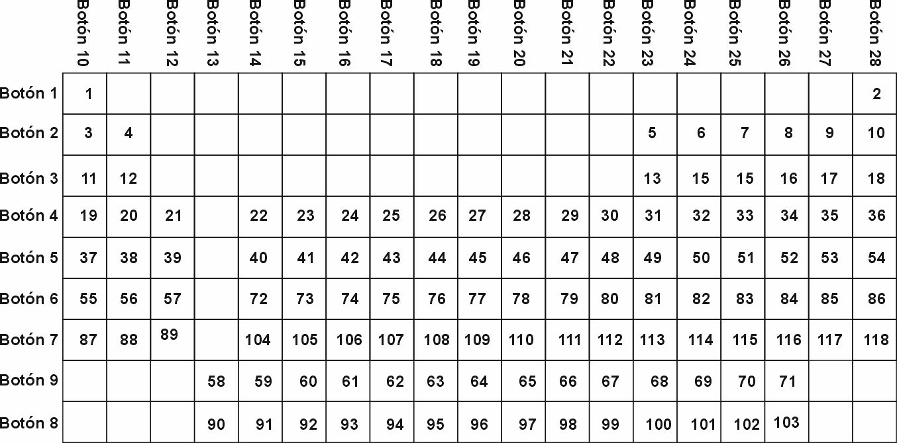
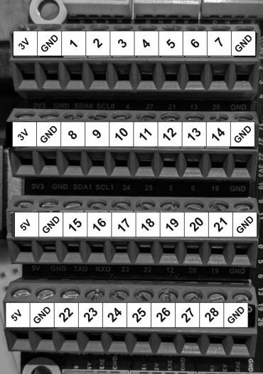

# Tabla Periódica Interactiva Multisensorial

Una innovación didáctica para la enseñanza inclusiva de física y química, diseñada especialmente para estudiantes con discapacidad visual en aulas inclusivas.

## 📖 Descripción del Proyecto

La Tabla Periódica Interactiva Multisensorial es un recurso físico tridimensional para la enseñanza de la química en contextos educativos inclusivos. Este proyecto surge como respuesta a la necesidad de herramientas didácticas adaptadas que permitan a todos los estudiantes, especialmente aquellos con discapacidad visual, acceder de manera autónoma y efectiva a uno de los conceptos más fundamentales de las ciencias.

### ✨ Características Principales

- **Estructura tridimensional**: Bloques modulares con alturas variables que representan propiedades físico-químicas de los elementos
- **Interactividad táctil y auditiva**: Botones que activan contenido sonoro con información detallada de cada elemento
- **Diseño Universal para el Aprendizaje (DUA)**: Funcional para estudiantes con y sin discapacidad visual
- **Bloques intercambiables**: Posibilidad de representar diferentes propiedades (punto de fusión, electronegatividad, etc.)
- **Autonomía educativa**: Permite exploración independiente sin dependencia del profesor

## 🎯 Objetivos

- Proporcionar acceso equitativo a la tabla periódica para estudiantes con discapacidad visual
- Facilitar la comprensión de conceptos abstractos mediante experiencias concretas y multisensoriales
- Promover la autonomía y la confianza en el aprendizaje de las ciencias
- Contribuir a despertar el interés por carreras STEM en todos los estudiantes
- Ofrecer un prototipo replicable para centros educativos

## 📁 Contenido del Repositorio

### 🐍 Código Python
- **`tabla_periodica_controller.py`**: Script para Raspberry Pi que gestiona los inputs de los botones y reproduce los archivos de audio correspondientes

### 📝 Guiones de Audio
- **`/guiones/`**: Directorio con todos los textos generados para cada elemento químico, utilizados para crear los archivos de audio. Los guiones incluyen:
- Curiosidades históricas
- Información sobre el descubrimiento de cada elemento
- Datos técnicos y propiedades físico-químicas

### 🖼️ Documentación Visual

*Vista frontal de la tabla periódica interactiva multisensorial construida*

*Vista posterior mostrando las conexiones eléctricas internas*

*Diagrama de matriz que muestra la organización y posición de cada botón correspondiente a los elementos químicos*

*Esquema de conexiones eléctricas entre los botones de la matriz y el HAT de la Raspberry Pi*

## 🔧 Requisitos Técnicos

### Hardware
- Raspberry Pi (modelo 4 o superior recomendado)
- HAT compatible para GPIO
- Botones táctiles
- Altavoces o sistema de audio
- Estructura física de la tabla (madera, impresión 3D, etc.)

## 🔊 Archivos de Audio

**Nota importante**: Los archivos de audio no están incluidos en este repositorio debido a limitaciones de tamaño en cuentas gratuitas de GitHub. Para obtener los archivos de audio completos, contacta por correo electrónico.

## 🎨 Diseño y Construcción

### Principios de Diseño
- **Accesibilidad**: Leyendas en braille, contrastes táctiles
- **Modularidad**: Bloques intercambiables para diferentes propiedades
- **Durabilidad**: Materiales resistentes al uso educativo
- **Portabilidad**: Estructura transportable entre aulas

## 📚 Fundamentación Pedagógica

Este proyecto se basa en:
- **Diseño Universal para el Aprendizaje (DUA)**: Múltiples formas de representación, participación y expresión
- **Aprendizaje multisensorial**: Combinación de estímulos táctiles, auditivos y visuales
- **Pedagogía inclusiva**: Diseñado para aulas con estudiantes de diferentes capacidades
- **Autonomía educativa**: Fomenta la exploración independiente

## 🎓 Contexto Académico

Este proyecto fue desarrollado como Trabajo de Fin de Máster en el Máster de Formación del Profesorado, especialidad Física y Química, con el objetivo de crear recursos didácticos innovadores para la educación inclusiva.

## 🙏 Agradecimientos

- Estudiantes y docentes que inspiraron este proyecto

**"Haciendo la química accesible para todos los estudiantes."**
